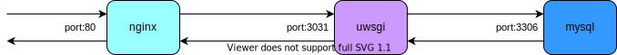

# flask sample app


## APIs

1. GET /health
    ```json
    {"status":"healthy"}
    ```
1. GET /users/1
    ```json
    {
        "id": 1,
        "name": "test_user1"
    }
    ```
1. POST /users/
    ```json
    curl -X POST -H "Content-Type: application/json" -d '{"name": "naka", "email": "naka@example.com"}' localhost:5000/users
    {
      "id": 7,
      "name": "naka"
    }
    ```

## Local Development

### With Local Python

1. Run MySQL

    ```
    docker-compose -f docker/docker-compose.yml up -d mysql
    ```

1. Local env

    ```
    python3 -m venv venv
    . venv/bin/activate
    cd src
    pip install -r sample/requirements.txt
    FLASK_APP=sample FLASK_ENV=development flask run
    ```

1. Check health

    ```
    curl localhost:5000/health
    {"status":"healthy"}
    ```

1. Run test

    ```
    cd src
    python -m pytest
    ==================================================== test session starts ====================================================
    platform darwin -- Python 3.7.8, pytest-6.2.1, py-1.10.0, pluggy-0.13.1
    rootdir: /Users/masato-naka/repos/nakamasato/flask-test/src
    collected 3 items

    tests/test_api.py ...                                                                                                 [100%]

    ===================================================== 3 passed in 0.06s =====================================================
    ```
### With Docker

1. Docker Compose

    ```
    docker-compose -f docker/docker-compose.yml up # add --build if you want to rebuild
    ```

1. Curl

    ```
    curl localhost:5000/health
    {"status":"healthy"}
    ```
